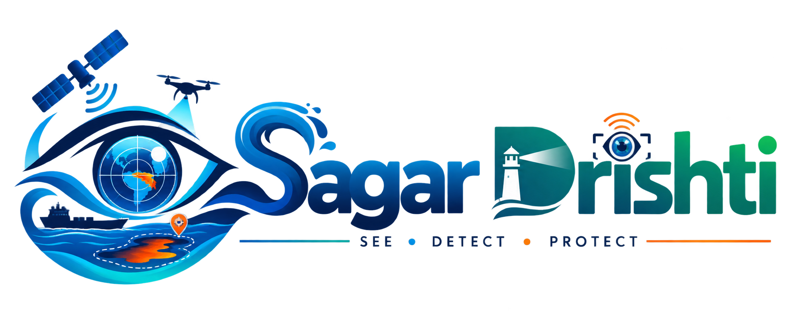
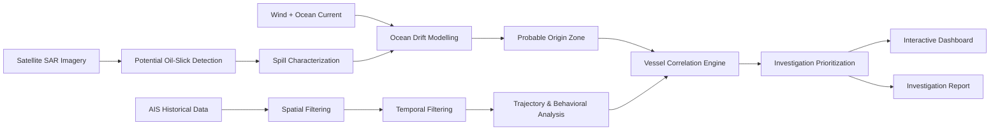
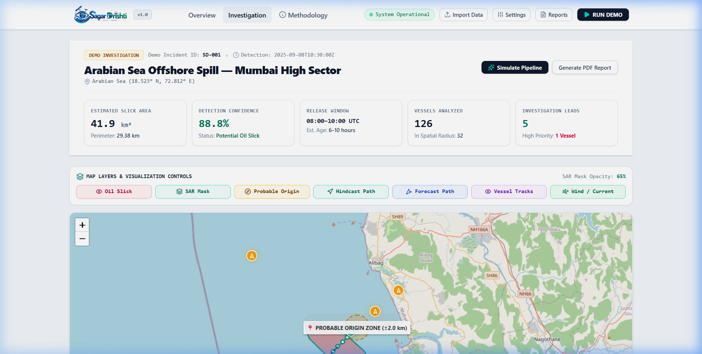
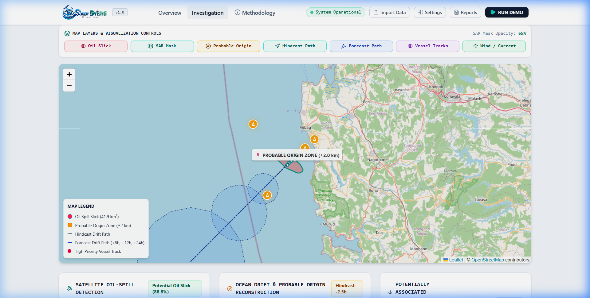
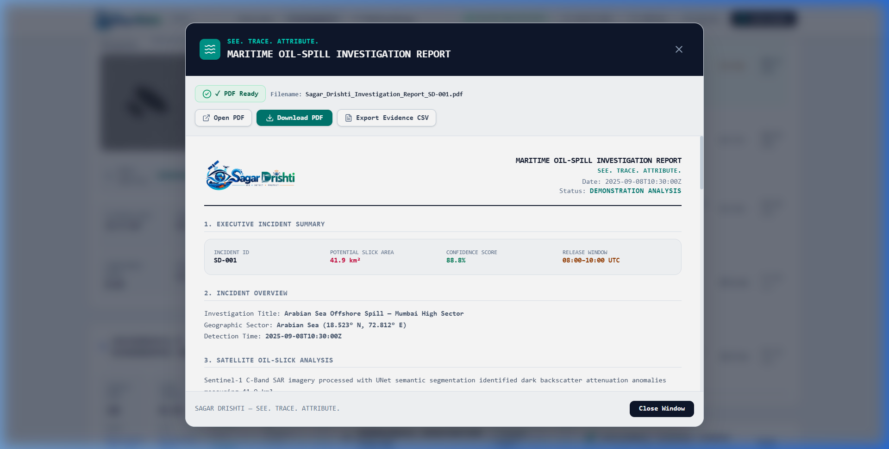

<p align="center">
  
</p>

<h1 align="center">Sagar Drishti</h1>

<p align="center">
  <strong>SEE. TRACE. ATTRIBUTE.</strong>
</p>

<p align="center">
  Maritime Environmental Intelligence for Oil-Spill Detection and Vessel Correlation
</p>

<p align="center">
  
  
  
  
  
</p>

---

Sagar Drishti is a maritime environmental intelligence platform designed to support oil-spill investigation by combining satellite imagery, oceanographic conditions and AIS vessel movement data in a unified analytical workflow.

The platform is designed to detect potential oil slicks from satellite imagery, characterize the detected slick, reconstruct probable drift and origin using environmental conditions, and correlate vessel movement histories to prioritize potentially associated vessels.

Sagar Drishti is an investigative decision-support system. Its outputs are intended to support further investigation and do not independently establish legal responsibility.

---

## 🚀 Quick Demo

Experience the end-to-end investigation workflow in 10 simple steps:

1. **Launch Platform**: Open `http://localhost:3000` in your web browser.
2. **Load Incident Scenario**: Click **"RUN DEMO"** or **"Simulate Pipeline"** to load the built-in scenario (`SD-001`).
3. **Execute Analysis Pipeline**: The system processes synthetic satellite SAR imagery and historical AIS telemetry.
4. **Inspect Satellite Detection**: View dark backscatter attenuation anomalies segmented by the computer vision module.
5. **Analyze Spill Metrics**: Review computed geometry, including slick area (**14.7 km²**), perimeter, and compactness.
6. **Reconstruct Drift & Origin**: View reverse advection hindcast ($T - 2.5\text{h}$) locating the **Probable Origin Zone** ($\pm 2.0\text{km}$).
7. **Filter Regional AIS Telemetry**: Observe funnel filtering reducing 126 regional vessels to 5 prioritized candidate leads.
8. **Inspect Vessel Correlation Rankings**: Click candidate vessels (e.g., *MT OCEAN STAR*) to review speed drops, AIS transmission gaps, and correlation breakdown scores (**91/100**).
9. **Open Investigation Report**: Click **"Generate PDF Report"** to launch the interactive document preview.
10. **Export PDF & CSV**: Click **"Download PDF"** for the formatted PDF report with embedded logo artwork or **"Export Evidence CSV"**.

> 💡 **Demonstration Data Notice**: Incident `SD-001` is a pre-configured, controlled demonstration scenario. It utilizes synthetic SAR imagery, simulated environmental ocean currents/wind, and synthetic AIS telemetry to demonstrate operational capabilities without representing a real-world disaster event.

---

## 📋 Table of Contents

- [Project Context](#project-context)
- [The Problem](#the-problem)
- [Our Solution](#our-solution)
- [Key Features](#key-features)
- [Why Sagar Drishti?](#why-sagar-drishti)
- [What Makes Sagar Drishti Different](#what-makes-sagar-drishti-different)
- [System Workflow](#system-workflow)
- [System Architecture](#system-architecture)
- [Technology Stack](#technology-stack)
- [Input Data](#input-data)
- [Dataset Sources](#dataset-sources)
- [Demo Mode](#demo-mode)
- [Data Import](#data-import)
- [Outputs](#outputs)
- [Vessel Correlation Model](#vessel-correlation-model)
- [Methodology](#methodology)
- [Limitations](#limitations)
- [Investigation Disclaimer](#investigation-disclaimer)
- [Screenshots](#screenshots)
- [Demo](#demo)
- [Project Structure](#project-structure)
- [Installation](#installation)
- [Environment Variables](#environment-variables)
- [Running Locally](#running-locally)
- [Interactive Map](#interactive-map)
- [Investigation Reports](#investigation-reports)
- [API Documentation](#api-documentation)
- [Security and Data Handling](#security-and-data-handling)
- [Validation and Testing](#validation-and-testing)
- [Feature Status](#feature-status)
- [Roadmap](#roadmap)
- [Contributing](#contributing)
- [License](#license)
- [Acknowledgements](#acknowledgements)
- [Team](#team)

---

## Project Context

| Item | Details |
| :--- | :--- |
| **Project** | Sagar Drishti |
| **Problem Statement ID** | PS26143 |
| **Problem Statement** | Leveraging satellite imagery to determine oil spills at sea along with AIS data correlations to identify vessel responsible for the spill |
| **Organization** | National Technical Research Organisation (NTRO) |
| **Category** | Software |
| **Theme** | Disaster Management |

---

## The Problem

Marine oil spills present severe risks to marine life, coastal ecology, and international maritime safety:
- **Detection vs. Attribution**: Detecting an oil slick via satellite imagery only confirms *where* oil is *now*, not *when* or *by whom* it was discharged.
- **Dynamic Ocean Transport**: Surface wind leeway and hydrodynamic ocean currents shift slicks away from their original discharge coordinates over hours or days.
- **High Vessel Density**: Busy shipping channels contain hundreds of transiting vessels, making manual track cross-referencing impractical.
- **Behavioral Anomaly Masking**: Discharges may coincide with deliberate AIS transmission gaps ("dark ships") or sudden speed slowdowns.
- **Need for Integrated Decision Support**: Maritime authorities require a unified platform combining satellite imagery, hydrodynamic physics, and AIS telemetry to filter noise and prioritize investigative leads.

---

## Our Solution

Sagar Drishti delivers an end-to-end investigative decision-support workflow:

```
Satellite Imagery
       ↓
Potential Oil-Slick Detection
       ↓
Spill Characterization (Area, Centroid)
       ↓
Wind + Ocean Current Analysis
       ↓
Backward Drift Reconstruction (Hindcasting)
       ↓
Probable Origin Zone (±Uncertainty Buffer)
       ↓
AIS Spatial & Temporal Filtering
       ↓
Trajectory & Behavioral Anomaly Analysis
       ↓
Vessel Correlation Scoring (0–100)
       ↓
Investigation Prioritization
       ↓
Interactive Dashboard & PDF Report
```

*Note: Sagar Drishti prioritizes **Potentially Associated Vessels** based on correlation signals. It does not issue definitive legal determinations.*

---

## Key Features

### 1. Satellite Oil-Slick Detection
- **SAR Image Processing**: Analyzes synthetic or Sentinel-1 SAR C-Band microwave imagery.
- **Computer Vision Segmentation**: Implements Gaussian noise filtering, Otsu thresholding, and morphological operations to identify dark backscatter attenuation anomalies.
- **Classification**: Generates a base64 overlay mask and classifies regions as **Potential Marine Oil Slick** with confidence metrics.

### 2. Spill Characterization
Extracts structural metrics from detected contours:
- **Estimated Area ($km^2$)**: Pixel-to-kilometer scaling (e.g., **14.7 km²** for SD-001).
- **Perimeter ($km$)**: Total boundary distance (**18.4 km**).
- **Spatial Geometry**: Centroid latitude/longitude, bounding box, length, width, and compactness ratio ($4\pi A / P^2$).

### 3. Ocean Drift Reconstruction (Hindcast)
- **Physics-Inspired Advection**: Simulates slick transport under combined surface wind (3.5% leeway factor) and ocean surface currents.
- **Reverse Backward Drift**: Computes backtrack trajectory points ($T - 0.5\text{h}$ to $T - 2.5\text{h}$) to identify the **Probable Origin Zone** ($18.558^\circ\text{N}, 72.846^\circ\text{E}$).
- **Coastline Boundary Clipping**: Enforces marine geometry validation to keep drift trajectories within ocean waters.

### 4. Forward Drift Forecast
- Predicts future slick advection at $+6\text{h}$, $+12\text{h}$, and $+24\text{h}$ intervals.
- Renders expanding uncertainty polygons for spill containment planning.

### 5. AIS Vessel Filtering
- **Spatial Filter**: Filters regional AIS records within a 25 km bounding radius of the probable origin zone.
- **Temporal Filter**: Matches vessel historical positions during the estimated release window (**08:00–10:00 UTC**).

### 6. Multi-Factor Vessel Correlation
Evaluates 6 independent weighted evidence signals:
1. **Spatial Distance** to probable origin.
2. **Temporal Alignment** with discharge window.
3. **Trajectory Intersection** with origin uncertainty polygon.
4. **Behavioral Anomalies** (e.g., speed drop from 13.5 to 2.1 knots).
5. **AIS Telemetry Gaps** (e.g., 28-minute transmission gap near origin).
6. **Drift Path Consistency** with hindcast direction.

### 7. Explainable Vessel Ranking
- Computes a normalized **Correlation Score (0–100)** and assigns an **Investigation Priority** (**HIGH**, **MEDIUM**, **LOW**).
- Displays granular evidence checklists for complete audit transparency.

### 8. Chronological Incident Timeline
Provides a unified temporal feed linking vessel entry, slowdowns, AIS gaps, release window bounds, and satellite acquisition.

### 9. Interactive Map
Built on Leaflet with clean OpenStreetMap light basemaps, rendering togglable layers for oil slicks, probable origin zones, backtrack paths, forecast polygons, and vessel markers.

### 10. Enterprise Investigation Reports
- **PDF Report**: Downloads a structured investigation document with embedded official logo graphics, native ReportLab flowables, and executive summaries.
- **CSV Export**: Serves structured vessel evidence leads for external analytical tools.

---

## Why Sagar Drishti?

| Investigation Challenge | Sagar Drishti Approach |
| :--- | :--- |
| **Detecting a potential slick** | Automated satellite SAR dark backscatter segmentation |
| **Measuring the slick** | Automated geometric characterization (area, perimeter, compactness) |
| **Unknown release location** | Backward hydrodynamic advection drift reconstruction |
| **Unknown release window** | SAR decay & drift-based release time window estimation |
| **Too many nearby vessels** | Multi-stage spatial (25km) & temporal AIS funnel filtering |
| **Comparing vessel behavior** | Automated detection of speed drops & AIS transmission gaps |
| **Difficult manual prioritization** | Explainable 6-factor correlation scoring (0–100) |
| **Reporting results** | One-click PDF report with embedded logo & CSV export |

---

## What Makes Sagar Drishti Different

- **Multi-Source Intelligence**: Fuses satellite SAR imagery, oceanographic drift physics, and AIS telemetry.
- **End-to-End Workflow**: Unifies detection, tracing, correlation, visualization, and report export.
- **Explainable Prioritization**: Scores include transparent evidence breakdowns rather than black-box outputs.
- **Spatial-Temporal Reasoning**: Simultaneously evaluates geographic proximity and time alignment.
- **Uncertainty Awareness**: Models origin areas as uncertainty zones ($\pm 2.0\text{km}$) rather than artificial points.
- **Marine-Aware Geospatial Clipping**: Validates trajectory coordinates against coastal boundary constraints.

---

## System Workflow



---

## System Architecture

```
+-----------------------------------------------------------------------------------+
|                                 FRONTEND UI LAYER                                 |
|          React 18 + Vite + TypeScript + Tailwind CSS + Leaflet Maps               |
|      (Dashboard, Layer Controls, Evidence Cards, Interactive PDF Preview)         |
+-----------------------------------------------------------------------------------+
                                         │
                                   HTTP / REST API
                                         │
+-----------------------------------------------------------------------------------+
|                                BACKEND API LAYER                                  |
|                         FastAPI + Uvicorn + Pydantic                               |
+-----------------------------------------------------------------------------------+
                                         │
         ┌───────────────────────────────┼───────────────────────────────┐
         │                               │                               │
         ▼                               ▼                               ▼
+------------------+           +-------------------+           +-------------------+
| COMPUTER VISION  |           |   DRIFT PHYSICS   |           |  AIS CORRELATION  |
|  OpenCV Engine   |           | 2D Advection Model|           |  Anomaly & Rank   |
| (Threshold/Mask) |           | (Hindcast/Forecast|           | (Multi-Factor)    |
+------------------+           +-------------------+           +-------------------+
                                                                         │
                                                                         ▼
                                                               +-------------------+
                                                               |  REPORTING ENGINE |
                                                               | ReportLab (PDF)   |
                                                               | CSV Exporter      |
                                                               +-------------------+
```

---

## Technology Stack

| Layer | Technology | Purpose |
| :--- | :--- | :--- |
| **Frontend Framework** | React 18 & Vite | Interactive dashboard & UI state management |
| **Styling** | Tailwind CSS | Light Maritime Enterprise theme & glassmorphism |
| **Mapping** | Leaflet (`react-leaflet`) | OpenStreetMap geospatial layer visualization |
| **Icons** | Lucide React | Visual dashboard UI iconography |
| **Backend API** | Python 3.10+ & FastAPI | REST API endpoints & request validation |
| **Server** | Uvicorn | ASGI web server execution |
| **Computer Vision** | OpenCV (`cv2`) & NumPy | Image decoding, noise filtering, contour segmentation |
| **Geospatial Math** | Custom Haversine & Vector Math | Advection calculations & coastal boundary clipping |
| **PDF Generation** | ReportLab | Native PDF canvas builder & logo embedding |
| **Testing** | Pytest & FastAPI TestClient | Automated PDF signature & endpoint verification |

---

## Input Data

### 1. Satellite Imagery
- **Format**: Synthetic SAR image bytes or Sentinel-1 C-Band GeoTIFF/PNG.
- **Required Parameters**: Center latitude, center longitude, spatial resolution scale ($50\text{m/px}$).

### 2. AIS Telemetry Data
- **Format**: CSV upload or JSON feed.
- **Required Fields**: `MMSI`, `VesselName`, `VesselType`, `Timestamp`, `Latitude`, `Longitude`, `SpeedOverGround` (SOG), `CourseOverGround` (COG).

### 3. Environmental Conditions
- **Wind Parameters**: Speed ($km/h$), direction ($^\circ$), direction label (e.g., `NE`).
- **Current Parameters**: Speed ($m/s$), direction ($^\circ$), direction label (e.g., `SW`).

---

## Dataset Sources

- **AIS Data Format Reference**: [MarineCadastre AccessAIS](https://marinecadastre.gov/accessais/) (Official U.S. coastal AIS sample data format).
- **Satellite SAR Reference Dataset**: [Zenodo Sentinel-1 SAR Oil Spill Dataset](https://zenodo.org/records/3655294) (Oil spill satellite classification benchmark).
- **Demonstration Data**: Built-in scenario `SD-001` utilizes synthetic SAR images, simulated oceanographic parameters, and synthetic AIS vessel tracks for controlled offline demonstration.

---

## Demo Mode

Sagar Drishti includes a built-in demonstration scenario:
- **Incident ID**: `SD-001`
- **Title**: *Arabian Sea Offshore Spill — Mumbai High Sector*
- **Coordinates**: $18.523^\circ\text{N}, 72.812^\circ\text{E}$
- **Detection Area**: $14.7\text{ km}^2$
- **Primary Lead**: *MT OCEAN STAR* (MMSI: 419001892, Oil Tanker)
- **Data Status**: Controlled synthetic demonstration scenario.

---

## Data Import

The application supports custom user data uploads via the API and UI:
1. **SAR Image Upload** (`POST /api/detect-spill`): Upload custom satellite image files to perform automated dark-slick segmentation.
2. **AIS CSV Upload** (`POST /api/ais/upload`): Upload raw multi-vessel AIS CSV telemetry files to extract and filter tracks near origin coordinates.

---

## Outputs

- **Spill Analysis**: Mask overlay (base64), area ($km^2$), perimeter ($km$), centroid, compactness, estimated release window.
- **Drift Analysis**: Backtrack trajectory points, probable origin zone coordinates with uncertainty radius, 6h/12h/24h forecast polygons.
- **Vessel Analysis**: Filtered vessel count, correlation score (0–100), investigation priority rating, evidence checklist, anomaly logs.
- **Reports**: Downloadable formatted PDF report (`Sagar_Drishti_Investigation_Report_SD-001.pdf`) and CSV evidence file (`Sagar_Drishti_Evidence_SD-001.csv`).

---

## Vessel Correlation Model

$$\text{Correlation Score} = \frac{\sum (S_i \cdot W_i)}{\sum W_i}$$

| Signal ($S_i$) | Default Weight ($W_i$) | Description |
| :--- | :---: | :--- |
| **Spatial Proximity** | **25%** | Proximity of closest vessel position to probable origin zone |
| **Temporal Alignment** | **25%** | Presence within estimated release time window (08:00–10:00 UTC) |
| **Trajectory Intersection** | **20%** | Historical path overlap with origin uncertainty polygon |
| **Behavioral Anomaly** | **10%** | Significant vessel slowdown (e.g., speed drop $>5$ knots) |
| **AIS Transmission Gap** | **10%** | Unexplained telemetry blackout (e.g., gap $>15$ mins) |
| **Drift Consistency** | **10%** | Heading alignment with reverse ocean drift vector |

---

## Methodology

1. **SAR Interpretation**: Dark backscatter attenuation regions identified against ocean background noise.
2. **Segmentation**: Morphological cleaning and contour extraction isolate primary slick boundaries.
3. **Spill Characterization**: Geometric equations compute physical area, perimeter, and compactness.
4. **Ocean Drift Physics**: Net drift vector calculated: $\vec{V}_{\text{drift}} = \vec{V}_{\text{current}} + 0.035 \cdot \vec{V}_{\text{wind}}$.
5. **Backward Hindcasting**: Stepwise backward advection locates the probable origin zone.
6. **Forward Forecasting**: Forward advection models future slick movement.
7. **AIS Correlation**: Multi-factor weighted scoring ranks candidate leads into an explainable audit checklist.

---

## Limitations

- **SAR Look-Alikes**: Low wind conditions ($<3\text{ m/s}$), natural organic films, and wind shadows can produce dark SAR regions that mimic oil slicks.
- **Environmental Drift Modeling**: Simplified 2D advection models assume uniform localized wind/current fields.
- **AIS Data Gaps**: Non-cooperative vessels turning off AIS transponders cannot be tracked via AIS feeds alone.
- **Legal Non-Attribution**: High correlation scores represent investigative leads and do not constitute legal proof of guilt.

---

## Investigation Disclaimer

> *Sagar Drishti is an investigative decision-support system. Its analytical outputs and correlation scores are intended to help prioritize potential leads for further investigation. They do not establish legal responsibility, identify a confirmed culprit, or constitute definitive proof that a vessel caused an oil spill. Results should be independently verified by competent maritime, environmental and investigative authorities.*

---

## Screenshots

### 1. Investigation Command Center

*Integrated maritime intelligence dashboard displaying satellite detection metrics, layer controls, and OpenStreetMap basemap.*

### 2. Geospatial Drift & Origin Map

*Interactive Leaflet map showing oil slick polygon, probable origin zone, ocean-clipped drift trajectories, and vessel positions.*

### 3. PDF Investigation Report Preview

*PDF report generation preview modal featuring the official Sagar Drishti logo artwork and executive summary breakdown.*

---

## Demo

Interactive demonstration mode is built directly into the application codebase. Click **"RUN DEMO"** in the top navigation bar to load scenario `SD-001`.

---

## Project Structure

```
Sagar Drishti/
├── assets/
│   └── sagar-drishti-logo.svg        # Official Sagar Drishti SVG logo asset
├── docs/
│   └── screenshots/                   # Project verification screenshots
│       ├── dashboard_overview.png
│       ├── map_drift_analysis.png
│       └── report_preview.png
├── backend/
│   ├── app/
│   │   ├── api/
│   │   │   └── routes.py              # FastAPI endpoints
│   │   ├── ais/                       # AIS parsing & anomaly detection
│   │   ├── assets/                    # Backend logo assets for PDF generator
│   │   │   ├── sagar-drishti-logo.png
│   │   │   └── sagar-drishti-logo.svg
│   │   ├── correlation/               # Vessel correlation engine
│   │   ├── data/                      # Demo scenario data (SD-001)
│   │   ├── drift/                     # Ocean advection drift model
│   │   ├── geospatial/                # Haversine & coastline clipping math
│   │   ├── ml/                        # OpenCV SAR detection module
│   │   ├── report/                    # ReportLab PDF & CSV generators
│   │   └── main.py                    # FastAPI application initialization
│   ├── tests/
│   │   └── test_pdf_report.py         # Pytest verification suite
│   └── run_server.py                  # Uvicorn server entry point
├── frontend/
│   ├── public/
│   │   └── assets/                    # Public web assets & logos
│   ├── src/
│   │   ├── components/                # React UI components (MapContainer, ReportModal, etc.)
│   │   ├── services/                  # API fetch client & standalone fallback engine
│   │   ├── types/                     # TypeScript interface definitions
│   │   ├── App.tsx                    # Main dashboard application
│   │   └── main.tsx                   # React DOM entry point
│   ├── package.json                   # Frontend dependencies
│   └── vite.config.ts                 # Vite bundler & API proxy configuration
├── .env.example                       # Environment configuration template
├── .gitignore                         # Git ignore rules
├── LICENSE                            # MIT License
└── README.md                          # Project documentation
```

---

## Installation

### Prerequisites
- **Node.js**: v18.0.0 or higher
- **Python**: v3.10.0 or higher
- **Git**

### Step 1: Clone Repository
```bash
git clone https://github.com/omjadhav9641/SagarDrishti.git
cd SagarDrishti
```

### Step 2: Install Backend Dependencies
```bash
cd backend
python -m venv venv

# Activate virtual environment
# Windows:
.\venv\Scripts\activate
# Linux/macOS:
# source venv/bin/activate

pip install fastapi uvicorn reportlab opencv-python-headless numpy pydantic httpx pytest
```

### Step 3: Install Frontend Dependencies
```bash
cd ../frontend
npm install
```

---

## Environment Variables

Refer to `.env.example` for environment variable settings:

| Variable | Purpose | Default | Required |
| :--- | :--- | :--- | :---: |
| `PORT` | Backend FastAPI server port | `8005` | No |
| `HOST` | Backend server bind address | `127.0.0.1` | No |
| `VITE_PORT` | Frontend Vite development server port | `3000` | No |
| `VITE_API_BASE_URL` | Backend API base URL proxy | `http://127.0.0.1:8005` | No |

---

## Running Locally

### 1. Start Backend Server
In the `backend` directory:
```bash
python -m uvicorn app.main:app --host 127.0.0.1 --port 8005
```
Backend API will run at `http://127.0.0.1:8005` (API docs at `http://127.0.0.1:8005/docs`).

### 2. Start Frontend Server
In a new terminal window, inside the `frontend` directory:
```bash
npm run dev -- --port 3000
```
Frontend application will open at `http://localhost:3000`.

---

## Interactive Map

- **Tile Provider**: OpenStreetMap light basemap tiles (`https://tile.openstreetmap.org/{z}/{x}/{y}.png`).
- **Coastline Constraints**: All trajectories (backtrack, forecast, vessel paths) pass through `clip_path_to_ocean()` to ensure geometry terminates cleanly at the coastline.
- **Layer Controls**: Dynamic toggles for Oil Slick, SAR Mask, Probable Origin, Hindcast Path, Forecast Polygons, and Vessel Tracks.

---

## Investigation Reports

- **PDF Export**: Serves a structured PDF report generated via ReportLab containing embedded logo graphics, incident executive summary, spill metrics, environmental conditions, vessel rankings, evidence checklists, methodology, and legal disclaimers.
- **CSV Export**: Serves raw vessel correlation leads as downloadable CSV data (`Sagar_Drishti_Evidence_SD-001.csv`).

---

## API Documentation

| Method | Endpoint | Description |
| :--- | :--- | :--- |
| `GET` | `/api/health` | Returns system operational status & active module health |
| `GET` | `/api/demo` | Serves full pre-configured `SD-001` incident scenario data |
| `POST` | `/api/detect-spill` | Upload custom SAR image to execute CV dark slick segmentation |
| `POST` | `/api/drift/backcast` | Runs reverse advection to calculate probable origin coordinates |
| `POST` | `/api/drift/forecast` | Runs forward advection predicting future slick movement |
| `POST` | `/api/ais/upload` | Parse and filter uploaded multi-vessel AIS CSV telemetry |
| `POST` | `/api/vessels/rank` | Re-ranks vessel candidate leads using custom correlation weights |
| `GET` | `/api/report/pdf` | Generates & downloads formatted investigation PDF report |
| `GET` | `/api/report/csv` | Serves candidate vessel evidence leads as CSV file |

---

## Security and Data Handling

- **Secret Isolation**: Sensitive configuration settings isolated in environment variables.
- **Filename Sanitization**: Uploaded files and generated reports sanitized to prevent path traversal.
- **Input Validation**: API requests validated using Pydantic schemas.

---

## Validation and Testing

To run backend test suites verifying PDF magic byte signatures, embedded image objects, and API response headers:
```bash
cd backend
python tests/test_pdf_report.py
```
Expected output:
```text
PASS: test_pdf_report_endpoint (PDF signature, embedded image artwork, and clean formatting verified!)
PASS: test_csv_report_endpoint
ALL BACKEND PDF/CSV TESTS PASSED SUCCESSFULLY!
```

---

## Feature Status

| Feature | Status |
| :--- | :---: |
| **Satellite Oil-Slick Analysis** | Implemented |
| **Spill Characterization** | Implemented |
| **Probable Origin Estimation** | Implemented |
| **Hindcast Drift Modeling** | Implemented |
| **Forecast Drift Modeling** | Implemented |
| **AIS Spatial & Temporal Filtering** | Implemented |
| **Multi-Factor Vessel Correlation** | Implemented |
| **Explainable Lead Ranking** | Implemented |
| **Interactive Leaflet Map** | Implemented |
| **PDF Report Generation** | Implemented |
| **CSV Evidence Export** | Implemented |
| **Live Sentinel-1 Satellite API Feed** | Planned (Future Work) |
| **Live Marine Traffic AIS API Feed** | Planned (Future Work) |

---

## Roadmap

- **Live Sentinel-1 API Integration**: Direct connection to Copernicus Open Access Hub / Sentinel Hub.
- **Live AIS Feed Streaming**: Real-time WebSocket connection to AIS terrestrial and satellite streams.
- **Deep Learning UNet Segmentation**: Retraining deep neural networks on expanded multi-region SAR oil spill datasets.
- **High-Resolution Hydrodynamic Currents**: Integration with HYCOM / ERA5 real-time wind and ocean current APIs.

---

## Contributing

1. Fork the repository.
2. Create a feature branch (`git checkout -b feature/amazing-feature`).
3. Commit your changes (`git commit -m 'Add amazing feature'`).
4. Run validation tests (`python tests/test_pdf_report.py`).
5. Push to the branch (`git push origin feature/amazing-feature`).
6. Open a Pull Request.

---

## License

This project is licensed under the MIT License — see the [LICENSE](LICENSE) file for details.

---

## Acknowledgements

- **National Technical Research Organisation (NTRO)** — Problem statement context (PS26143).
- **MarineCadastre / AccessAIS** — AIS sample data structure reference.
- **Zenodo** — Sentinel-1 SAR Oil Spill Dataset benchmark.
- **OpenStreetMap** — Open cartographic tile basemaps.
- **ReportLab & OpenCV** — Open-source PDF generation and computer vision tools.

---

## Team

| Role | Member |
| :--- | :--- |
| **Team Lead** | Om Jadhav |
| **AI / ML Engineer** | Om Jadhav |
| **Backend Engineer** | Om Jadhav |
| **Frontend & GIS Engineer** | Om Jadhav |
| **Data & Domain Research** | Om Jadhav |

---

<p align="center">
  <sub>Sagar Drishti — Maritime Environmental Intelligence Platform</sub>
</p>
